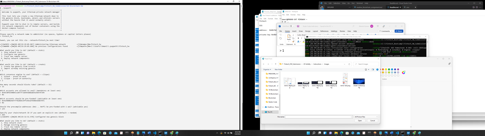

GITBASH 1 -Step 1
    
kmani@MANAN-VAT MINGW64 /c/Fintech_Bootcamp/Fintech_HW_Submission/18-Blockchain-HW
$ ./geth --datadir node1 account new
INFO [01-09|19:17:40.738] Maximum peer count                       ETH=50 LES=0 total=50
Your new account is locked with a password. Please give a password. Do not forget this password.
Password:
Repeat password:

Your new key was generated

Public address of the key:   0x9E30fD390843cdAf7F7a649588Da85424AF4f394
Path of the secret key file: node1\keystore\UTC--2022-01-10T01-18-14.300026900Z--9e30fd390843cdaf7f7a649588da85424af4f394

- You can share your public address with anyone. Others need it to interact with you.
- You must NEVER share the secret key with anyone! The key controls access to your funds!
- You must BACKUP your key file! Without the key, it's impossible to access account funds!
- You must REMEMBER your password! Without the password, it's impossible to decrypt the key!

kmani@MANAN-VAT MINGW64 /c/Fintech_Bootcamp/Fintech_HW_Submission/18-Blockchain-HW
$ ./geth --datadir node2 account new
INFO [01-09|19:18:48.773] Maximum peer count                       ETH=50 LES=0 total=50
Your new account is locked with a password. Please give a password. Do not forget this password.
Password:
Repeat password:

Your new key was generated

Public address of the key:   0x429B00e46FFFf82BDE19ff24Ed2f69B6566B74f1
Path of the secret key file: node2\keystore\UTC--2022-01-10T01-19-06.548469700Z--429b00e46ffff82bde19ff24ed2f69b6566b74f1

- You can share your public address with anyone. Others need it to interact with you.
- You must NEVER share the secret key with anyone! The key controls access to your funds!
- You must BACKUP your key file! Without the key, it's impossible to access account funds!
- You must REMEMBER your password! Without the password, it's impossible to decrypt the key!

kmani@MANAN-VAT MINGW64 /c/Fintech_Bootcamp/Fintech_HW_Submission/18-Blockchain-HW>kmani@MANAN-VAT MINGW64 /c/Fintech_Bootcamp/Fintech_HW_Submission/18-Blockchain-HW
$ ./geth --datadir node1 account new
INFO [01-09|19:17:40.738] Maximum peer count                       ETH=50 LES=0 total=50
Your new account is locked with a password. Please give a password. Do not forget this password.
Password:
Repeat password:

Your new key was generated

Public address of the key:   0x9E30fD390843cdAf7F7a649588Da85424AF4f394
Path of the secret key file: node1\keystore\UTC--2022-01-10T01-18-14.300026900Z--9e30fd390843cdaf7f7a649588da85424af4f394

- You can share your public address with anyone. Others need it to interact with you.
- You must NEVER share the secret key with anyone! The key controls access to your funds!
- You must BACKUP your key file! Without the key, it's impossible to access account funds!
- You must REMEMBER your password! Without the password, it's impossible to decrypt the key!

kmani@MANAN-VAT MINGW64 /c/Fintech_Bootcamp/Fintech_HW_Submission/18-Blockchain-HW
$ ./geth --datadir node2 account new
INFO [01-09|19:18:48.773] Maximum peer count                       ETH=50 LES=0 total=50
Your new account is locked with a password. Please give a password. Do not forget this password.
Password:
Repeat password:

Your new key was generated

Public address of the key:   0x429B00e46FFFf82BDE19ff24Ed2f69B6566B74f1
Path of the secret key file: node2\keystore\UTC--2022-01-10T01-19-06.548469700Z--429b00e46ffff82bde19ff24ed2f69b6566b74f1

- You can share your public address with anyone. Others need it to interact with you.
- You must NEVER share the secret key with anyone! The key controls access to your funds!
- You must BACKUP your key file! Without the key, it's impossible to access account funds!
- You must REMEMBER your password! Without the password, it's impossible to decrypt the key!

kmani@MANAN-VAT MINGW64 /c/Fintech_Bootcamp/Fintech_HW_Submission/18-Blockchain-HW

   
Password Used: assignment_mk1

GITBASH 2 -Step 2

kmani@MANAN-VAT MINGW64 /c/Fintech_Bootcamp/Fintech_HW_Submission/18-Blockchain-HW
$ ./puppeth
+-----------------------------------------------------------+
| Welcome to puppeth, your Ethereum private network manager |
|                                                           |
| This tool lets you create a new Ethereum network down to  |
| the genesis block, bootnodes, miners and ethstats servers |
| without the hassle that it would normally entail.         |
|                                                           |
| Puppeth uses SSH to dial in to remote servers, and builds |
| its network components out of Docker containers using the |
| docker-compose toolset.                                   |
+-----------------------------------------------------------+

Please specify a network name to administer (no spaces, hyphens or capital letters please)
> fintech_hw

Sweet, you can set this via --network=fintech_hw next time!

←[32mINFO ←[0m[01-09|19:29:05.867] Administering Ethereum network           ←[32mname←[0m=fintech_hw
←[33mWARN ←[0m[01-09|19:29:05.868] No previous configurations found         ←[33mpath←[0m=C:\\Users\\kmani\\.puppeth\\fintech_hw

What would you like to do? (default = stats)
 1. Show network stats
 2. Configure new genesis
 3. Track new remote server
 4. Deploy network components
> 2

What would you like to do? (default = create)
 1. Create new genesis from scratch
 2. Import already existing genesis
> 1

Which consensus engine to use? (default = clique)
 1. Ethash - proof-of-work
 2. Clique - proof-of-authority
> 2

How many seconds should blocks take? (default = 15)
> 15

Which accounts are allowed to seal? (mandatory at least one)
> 0x9E30fD390843cdAf7F7a649588Da85424AF4f394
> 0x

Which accounts should be pre-funded? (advisable at least one)
> 0x429B00e46FFFf82BDE19ff24Ed2f69B6566B74f1
> 0x

Should the precompile-addresses (0x1 .. 0xff) be pre-funded with 1 wei? (advisable yes)
> yes

Specify your chain/network ID if you want an explicit one (default = random)
> 665
←[32mINFO ←[0m[01-09|19:32:51.978] Configured new genesis block

What would you like to do? (default = stats)
 1. Show network stats
 2. Manage existing genesis
 3. Track new remote server
 4. Deploy network components
> 2

 1. Modify existing configurations
 2. Export genesis configurations
 3. Remove genesis configuration
> 2

Which folder to save the genesis specs into? (default = current)
  Will create fintech_hw.json, fintech_hw-aleth.json, fintech_hw-harmony.json, fintech_hw-parity.json
>
←[32mINFO ←[0m[01-09|19:33:22.043] Saved native genesis chain spec          ←[32mpath←[0m=fintech_hw.json
←[31mERROR←[0m[01-09|19:33:22.043] Failed to create Aleth chain spec        ←[31merr←[0m="unsupported consensus engine"
←[31mERROR←[0m[01-09|19:33:22.044] Failed to create Parity chain spec       ←[31merr←[0m="unsupported consensus engine"
←[32mINFO ←[0m[01-09|19:33:22.046] Saved genesis chain spec                 ←[32mclient←[0m=harmony ←[32mpath←[0m=fintech_hw-harmony.json

What would you like to do? (default = stats)
 1. Show network stats
 2. Manage existing genesis
 3. Track new remote server
 4. Deploy network components

GITBASH 3 -Step 2

GIT INIT 2 nodes

kmani@MANAN-VAT MINGW64 /c/Fintech_Bootcamp/Fintech_HW_Submission/18-Blockchain-HW
$ ./geth --datadir node1 init fintech_hw.json
INFO [01-09|19:37:25.940] Maximum peer count                       ETH=50 LES=0 total=50
INFO [01-09|19:37:26.116] Allocated cache and file handles         database=C:\\Fintech_Bootcamp\\Fintech_HW_Submission\\18-Blockchain-HW\\node1\\geth\\chaindata cache=16.00MiB handles=16
INFO [01-09|19:37:26.136] Writing custom genesis block
INFO [01-09|19:37:26.145] Persisted trie from memory database      nodes=356 size=50.77KiB time=1.0328ms gcnodes=0 gcsize=0.00B gctime=0s livenodes=1 livesize=0.00B
INFO [01-09|19:37:26.152] Successfully wrote genesis state         database=chaindata hash=143f03…ee5496
INFO [01-09|19:37:26.155] Allocated cache and file handles         database=C:\\Fintech_Bootcamp\\Fintech_HW_Submission\\18-Blockchain-HW\\node1\\geth\\lightchaindata cache=16.00MiB handles=16
INFO [01-09|19:37:26.179] Writing custom genesis block
INFO [01-09|19:37:26.187] Persisted trie from memory database      nodes=356 size=50.77KiB time=1.0339ms gcnodes=0 gcsize=0.00B gctime=0s livenodes=1 livesize=0.00B
INFO [01-09|19:37:26.194] Successfully wrote genesis state         database=lightchaindata hash=143f03…ee5496

kmani@MANAN-VAT MINGW64 /c/Fintech_Bootcamp/Fintech_HW_Submission/18-Blockchain-HW
$ ./geth --datadir node2 init fintech_hw.json
INFO [01-09|19:37:37.892] Maximum peer count                       ETH=50 LES=0 total=50
INFO [01-09|19:37:37.982] Allocated cache and file handles         database=C:\\Fintech_Bootcamp\\Fintech_HW_Submission\\18-Blockchain-HW\\node2\\geth\\chaindata cache=16.00MiB handles=16
INFO [01-09|19:37:38.016] Writing custom genesis block
INFO [01-09|19:37:38.027] Persisted trie from memory database      nodes=356 size=50.77KiB time=2.0357ms gcnodes=0 gcsize=0.00B gctime=0s livenodes=1 livesize=0.00B
INFO [01-09|19:37:38.034] Successfully wrote genesis state         database=chaindata hash=143f03…ee5496
INFO [01-09|19:37:38.037] Allocated cache and file handles         database=C:\\Fintech_Bootcamp\\Fintech_HW_Submission\\18-Blockchain-HW\\node2\\geth\\lightchaindata cache=16.00MiB handles=16
INFO [01-09|19:37:38.050] Writing custom genesis block
INFO [01-09|19:37:38.056] Persisted trie from memory database      nodes=356 size=50.77KiB time=993.7µs  gcnodes=0 gcsize=0.00B gctime=0s livenodes=1 livesize=0.00B
INFO [01-09|19:37:38.063] Successfully wrote genesis state         database=lightchaindata hash=143f03…ee5496

kmani@MANAN-VAT MINGW64 /c/Fintech_Bootcamp/Fintech_HW_Submission/18-Blockchain-HW
$

GITBASH 4 -Step 4

Use command: 
./geth --datadir node1 --mine -minerthreads 1

Copy
enode://7d980783fedd87596169687d303e1f37b09fb568d068feb968a8fae36f44e1c1ee1b9171942a7751b500278e77acf61d45bc6bed9fbebace3b16d36ce7a51fae@127.0.0.1:30303

GITBASH 5 - Step 5

Open another gitbash window for final step: 

./geth --datadir node2 --port 30305 --rpc --bootnodes "enode://7d980783fedd87596169687d303e1f37b09fb568d068feb968a8fae36f44e1c1ee1b9171942a7751b500278e77acf61d45bc6bed9fbebace3b16d36ce7a51fae@127.0.0.1:30303" –ipcdisable
